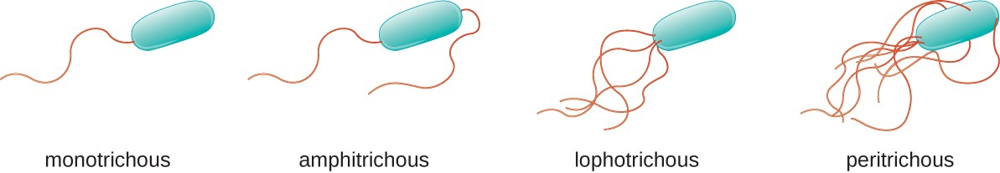
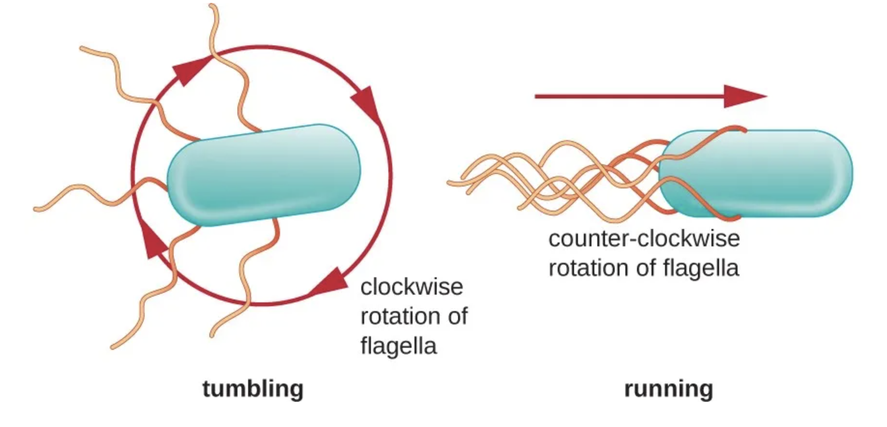
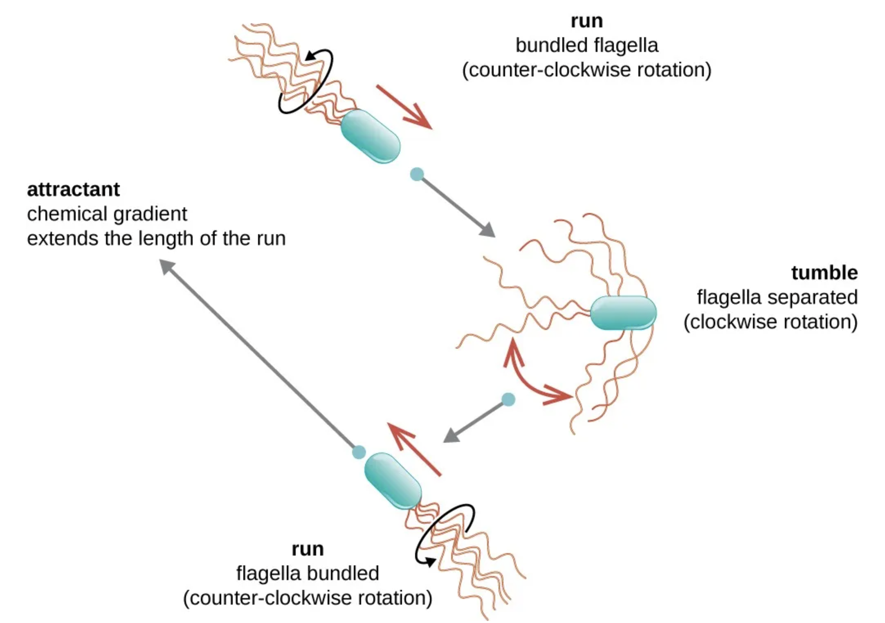
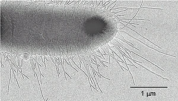
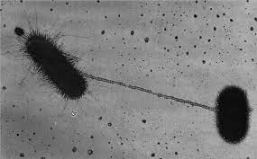
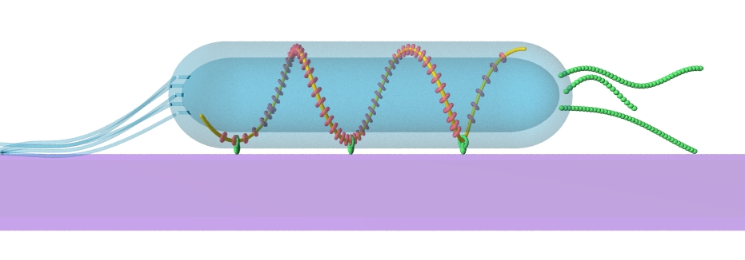
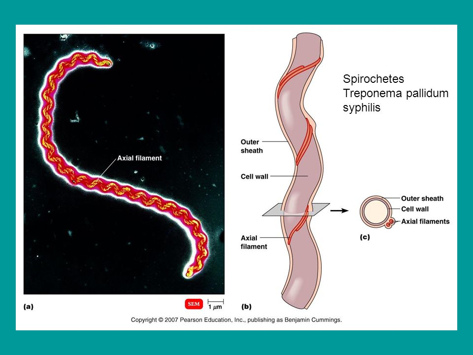
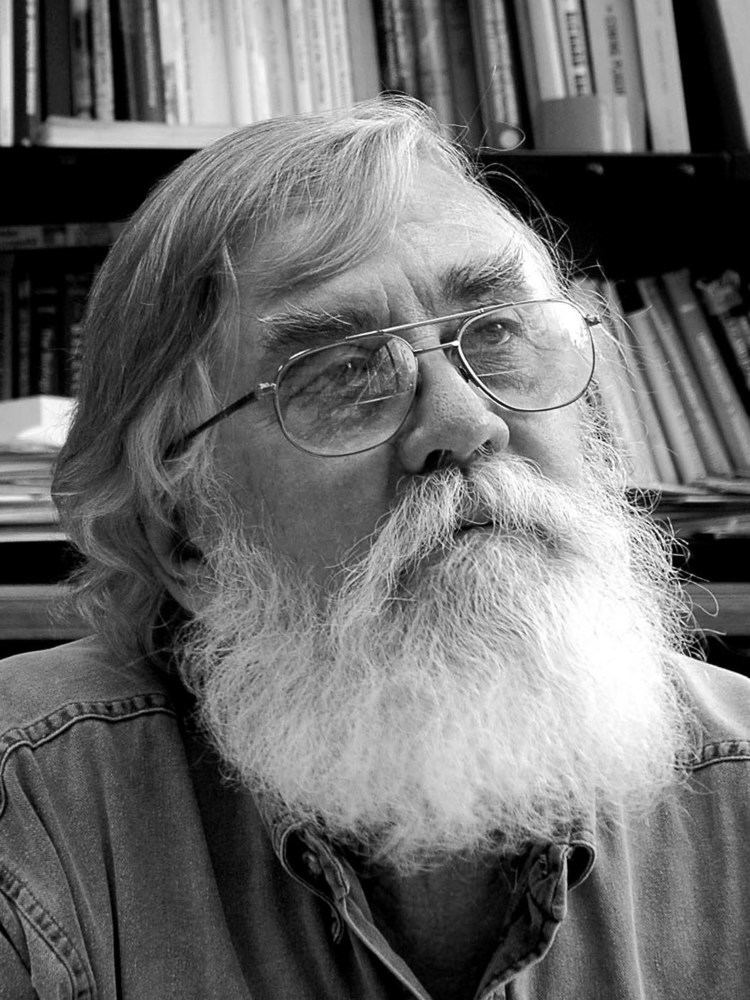

```{css, echo = FALSE}


pre {
  max-height: 200px;
  overflow-y: visible;
  overflow-x: visible;
  scrollbar-color: #007 #bada55;
}

pre[class] {
  max-height: 100px;
}


.scroll-100 {
  max-height: 100px;
  overflow-y: visible;

}


```


```{r, include = FALSE}

library(ape)
library(geiger)
library(phytools)
library(lattice)
library(nlme)
library(scales)
library(shape)
library(vioplot)

options(htmltools.dir.version = FALSE)
# preset code chunk options
knitr::opts_chunk$set(dpi = 300,            # ensures high resolution images
                      echo = FALSE,         # FALSE: code chunks don't show
                      include = FALSE,      # FALSE: code chunks don't show
                      warning = FALSE,      # FALSE: suppresses warning messages
                      error = FALSE,       # FALSE: Suppresses error messages
                      fig.align = "center")


```


# Outline

## Motility in prokaryotes

- Kinds of appendages
- Movement
- Motility and the foraging mode paradigm
- Tradeoffs


--

## Current evidence

- Striking observations
- Analysis of findings


---
class: top
background-image: url("imgs/flagellum2.jpg")

# `r colorize("Flagella", "orange")`


---
# Types of flagella

<br><br><br>



---
# Flagella movement

<br>
<center>

</center>

---
# Flagella movement

<center>

</center>

---
# Fimbriae, pili, and conjugation

<center>


</center>

---
# Gliding

<br>
<center>

</center>

---
# Axial filament

<center>

</center>

---
class: top
background-image: url("imgs/bacteria_colorful.jpeg")

# `r colorize("No appendages", "orange")`

---
# The foraging-mode paradigm

.pull-left[
<center>
<br>Dr Eric Pianka
</center>

]

.pull-right[

<center>


<br>


</center>

]

---

```{r, include = TRUE}


par(mar = c(1, 1, 1, 1))
plot(NA, NA, xlim = c(0, 10), ylim = c(-1, 10), ann = FALSE, axes = FALSE)


text(5, 10, "Foraging mode")
segments(3.5, 9.6, 6.5, 9.6, lwd = 2)
segments(3.5, 10.4, 6.5, 10.4, lwd = 2)
segments(3.5, 10.4, 3.5, 9.6, lwd = 2)
segments(6.5, 10.4, 6.5, 9.6, lwd = 2)
text(5, 7, "Distance traveled")
segments(3.5, 6.5, 6.5, 6.5, lwd = 2)
segments(3.5, 7.5, 6.5, 7.5, lwd = 2)
segments(3.5, 6.5, 3.5, 7.5, lwd = 2)
segments(6.5, 7.5, 6.5, 6.5, lwd = 2)
text(8.6, 7, "Predation risk")
segments(7.5, 6.5, 9.8, 6.5, lwd = 2)
segments(7.5, 7.5, 9.8, 7.5, lwd = 2)
segments(7.5, 6.5, 7.5, 7.5, lwd = 2)
segments(9.8, 7.5, 9.8, 6.5, lwd = 2)

Arrows(5, 9.5, 5, 7.8, lwd = 2, arr.type = "triangle")
Arrows(6.6, 7, 7, 7, lwd = 2, arr.type = "triangle")

```

---


```{r, include = TRUE}

par(mar = c(1, 1, 1, 1))
plot(NA, NA, xlim = c(0, 10), ylim = c(-1, 10), ann = FALSE, axes = FALSE)


text(5, 10, "Foraging mode")
segments(3.5, 9.6, 6.5, 9.6, lwd = 2)
segments(3.5, 10.4, 6.5, 10.4, lwd = 2)
segments(3.5, 10.4, 3.5, 9.6, lwd = 2)
segments(6.5, 10.4, 6.5, 9.6, lwd = 2)
text(5, 7, "Distance traveled")
segments(3.5, 6.5, 6.5, 6.5, lwd = 2)
segments(3.5, 7.5, 6.5, 7.5, lwd = 2)
segments(3.5, 6.5, 3.5, 7.5, lwd = 2)
segments(6.5, 7.5, 6.5, 6.5, lwd = 2)
text(8.6, 7, "Predation risk")
segments(7.5, 6.5, 9.8, 6.5, lwd = 2)
segments(7.5, 7.5, 9.8, 7.5, lwd = 2)
segments(7.5, 6.5, 7.5, 7.5, lwd = 2)
segments(9.8, 7.5, 9.8, 6.5, lwd = 2)
text(8.64, 3.7, "Reproductive effort")
segments(7.2, 4.2, 10.1, 4.2, lwd = 2)
segments(7.2, 3.2, 10.1, 3.2, lwd = 2)
segments(7.2, 4.2, 7.2, 3.2, lwd = 2)
segments(10.1, 3.2, 10.1, 4.2, lwd = 2)

Arrows(5, 9.5, 5, 7.8, lwd = 2, arr.type = "triangle")
Arrows(6.6, 7, 7, 7, lwd = 2, arr.type = "triangle")
Arrows(8.7, 4.8, 8.7, 6.1, lwd = 2, arr.type = "triangle")
Arrows(8.7, 6.1, 8.7, 4.8, lwd = 2, arr.type = "triangle")
Arrows(8.3, 4.76, 6.3, 6.2, lwd = 2, arr.type = "triangle")


```


---


```{r, include = TRUE}


par(mar = c(1, 1, 1, 1))
plot(NA, NA, xlim = c(0, 10), ylim = c(-1, 10), ann = FALSE, axes = FALSE)


text(5, 10, "Foraging mode")
segments(3.5, 9.6, 6.5, 9.6, lwd = 2)
segments(3.5, 10.4, 6.5, 10.4, lwd = 2)
segments(3.5, 10.4, 3.5, 9.6, lwd = 2)
segments(6.5, 10.4, 6.5, 9.6, lwd = 2)
text(5, 7, "Distance traveled")
segments(3.5, 6.5, 6.5, 6.5, lwd = 2)
segments(3.5, 7.5, 6.5, 7.5, lwd = 2)
segments(3.5, 6.5, 3.5, 7.5, lwd = 2)
segments(6.5, 7.5, 6.5, 6.5, lwd = 2)
text(8.6, 7, "Predation risk")
segments(7.5, 6.5, 9.8, 6.5, lwd = 2)
segments(7.5, 7.5, 9.8, 7.5, lwd = 2)
segments(7.5, 6.5, 7.5, 7.5, lwd = 2)
segments(9.8, 7.5, 9.8, 6.5, lwd = 2)
text(8.64, 3.7, "Reproductive effort")
segments(7.2, 4.2, 10.1, 4.2, lwd = 2)
segments(7.2, 3.2, 10.1, 3.2, lwd = 2)
segments(7.2, 4.2, 7.2, 3.2, lwd = 2)
segments(10.1, 3.2, 10.1, 4.2, lwd = 2)
text(4.97, 3.7, "Energy gain")
segments(3.7, 4.2, 6.2, 4.2, lwd = 2)
segments(3.7, 3.2, 6.2, 3.2, lwd = 2)
segments(3.7, 4.2, 3.7, 3.2, lwd = 2)
segments(6.2, 4.2, 6.2, 3.2, lwd = 2)


Arrows(5, 9.5, 5, 7.8, lwd = 2, arr.type = "triangle")
Arrows(6.6, 7, 7, 7, lwd = 2, arr.type = "triangle")
Arrows(8.7, 4.8, 8.7, 6.1, lwd = 2, arr.type = "triangle")
Arrows(8.7, 6.1, 8.7, 4.8, lwd = 2, arr.type = "triangle")
Arrows(8.3, 4.76, 6.3, 6.2, lwd = 2, arr.type = "triangle")
Arrows(5, 4.8, 5, 6.1, lwd = 2, arr.type = "triangle")
Arrows(5, 9.5, 5, 7.8, lwd = 2, arr.type = "triangle")
Arrows(5, 6.3, 5, 4.8, lwd = 2, arr.type = "triangle")

```

---


```{r, include = TRUE}

par(mar = c(1, 1, 1, 1))
plot(NA, NA, xlim = c(0, 10), ylim = c(-1, 10), ann = FALSE, axes = FALSE)
text(5, 10, "Foraging mode")
segments(3.5, 9.6, 6.5, 9.6, lwd = 2)
segments(3.5, 10.4, 6.5, 10.4, lwd = 2)
segments(3.5, 10.4, 3.5, 9.6, lwd = 2)
segments(6.5, 10.4, 6.5, 9.6, lwd = 2)
text(5, 7, "Distance traveled")
segments(3.5, 6.5, 6.5, 6.5, lwd = 2)
segments(3.5, 7.5, 6.5, 7.5, lwd = 2)
segments(3.5, 6.5, 3.5, 7.5, lwd = 2)
segments(6.5, 7.5, 6.5, 6.5, lwd = 2)
text(4.97, 3.7, "Energy gain")
segments(3.7, 4.2, 6.2, 4.2, lwd = 2)
segments(3.7, 3.2, 6.2, 3.2, lwd = 2)
segments(3.7, 4.2, 3.7, 3.2, lwd = 2)
segments(6.2, 4.2, 6.2, 3.2, lwd = 2)
text(8.6, 7, "Predation risk")
segments(7.5, 6.5, 9.8, 6.5, lwd = 2)
segments(7.5, 7.5, 9.8, 7.5, lwd = 2)
segments(7.5, 6.5, 7.5, 7.5, lwd = 2)
segments(9.8, 7.5, 9.8, 6.5, lwd = 2)
text(8.64, 3.7, "Reproductive effort")
segments(7.2, 4.2, 10.1, 4.2, lwd = 2)
segments(7.2, 3.2, 10.1, 3.2, lwd = 2)
segments(7.2, 4.2, 7.2, 3.2, lwd = 2)
segments(10.1, 3.2, 10.1, 4.2, lwd = 2)
text(1.57, 3.7, "Energy expenditure")
segments(0, 4.2, 3.1, 4.2, lwd = 2)
segments(0, 3.2, 3.1, 3.2, lwd = 2)
segments(0, 4.2, 0, 3.2, lwd = 2)
segments(3.1, 4.2, 3.1, 3.2, lwd = 2)
Arrows(5, 9.5, 5, 7.8, lwd = 2, arr.type = "triangle")
Arrows(5, 6.3, 5, 4.8, lwd = 2, arr.type = "triangle")
Arrows(5, 4.8, 5, 6.1, lwd = 2, arr.type = "triangle")
Arrows(3.8, 6.3, 2, 4.8, lwd = 2, arr.type = "triangle")
Arrows(8.3, 4.76, 6.3, 6.2, lwd = 2, arr.type = "triangle")
Arrows(8.7, 6.1, 8.7, 4.8, lwd = 2, arr.type = "triangle")
Arrows(8.7, 4.8, 8.7, 6.1, lwd = 2, arr.type = "triangle")
Arrows(6.6, 7, 7, 7, lwd = 2, arr.type = "triangle")
Arrows(7.1, 3.7, 6.5, 3.7, lwd = 2, arr.type = "triangle")
Arrows(6.5, 3.7, 7.0, 3.7, lwd = 2, arr.type = "triangle")


```

---


```{r}

tree <- read.tree("spp.tree.nwk")
tree
#tree$tip.label

##plotTree(tree, type = "fan", ftype = "off")


data <- read.csv("condensed_traits_NCBI.csv")
str(data)
names(data)

```


```{r}


## Motility and cell size


spp.d1_lo <- data[!is.na(data$d1_lo), ]
str(spp.d1_lo)
length(spp.d1_lo$d1_lo)

spp.d1_up <- data[!is.na(data$d1_up), ]
str(spp.d1_up)
length(spp.d1_up$d1_up)

spp.motility <- data[!is.na(data$motility), ]
str(spp.motility)
length(spp.motility$motility)

spp.doubling <- data[!is.na(data$doubling_h), ]
str(spp.doubling)
length(spp.doubling$doubling_h)

doubling <- aggregate(spp.doubling$doubling_h, by = list(spp.doubling$species), mean, na.action = na.rm)
#motility <- aggregate(spp.motility$motility, by = list(spp.motility$species), unique, na.action = na.rm)
d1_up <- aggregate(spp.d1_up$d1_up, by = list(spp.d1_up$species), mean, na.action = na.rm)
d1_lo <- aggregate(spp.d1_lo$d1_lo, by = list(spp.d1_lo$species), mean, na.action = na.rm)


dim(doubling)
names(doubling) <- c("species", "doubling_h")
#dim(motility)
#names(motility) <- c("species", "motility")
dim(d1_up)
names(d1_up) <- c("species", "d1_up")
dim(d1_lo)
names(d1_lo) <- c("species", "d1_lo")

#class(motility)

mrg.motil <- merge(d1_up, d1_lo, by = "species")
class(mrg.motil)
str(mrg.motil)
head(mrg.motil)


obj <- rep()
for(i in mrg.motil$species){
    motility <- spp.motility$motility[mrg.motil$species == i][1]
    obj <- c(obj, motility)
}

dim(mrg.motil)
head(obj)

mrg.motil$motility <- obj
head(mrg.motil)
unique(mrg.motil$motility)

mrg.motil2 <- merge(mrg.motil, doubling, by = "species")
str(mrg.motil2)
head(mrg.motil2)
dim(mrg.motil2)

```


```{r}

## Motility vs cell size

##bwplot(d1_up ~ motility, data = mrg.motil)

apen <- c("axial filament", "flagella", "gliding", "no")

upd.mrg.motil <- mrg.motil[mrg.motil$motility %in% apen, ]

upd.mrg.motil <- upd.mrg.motil[upd.mrg.motil$d1_up < 4, ]

##bwplot(d1_up ~ motility, data = upd.mrg.motil)

motil.model <- lm(d1_up ~ motility, data = upd.mrg.motil)
summary(motil.model)

```

```{r, include = TRUE, out.width="61%"}

## Basic boxplot

vioplot(d1_up ~ motility, data = upd.mrg.motil, border = NA, method = "jitter", side = "right", ylab = expression(paste("Cell size")~log[10]~(mu*m)), xlab = "Motility", col = "white", las = 1)

grid(nx = NULL, ny = NULL, col = alpha("lightgray", 0.5), lwd = 1, lty = 2)

par(new = TRUE)

vioplot(d1_up ~ motility, data = upd.mrg.motil, border = NA, method = "jitter", side = "right", ylab = "", xlab = "", col = c(alpha("purple", 0.2), alpha("orange", 0.2), alpha("red", 0.2), alpha("blue", 0.2)), las = 1)

stripchart(d1_up ~ motility, data = upd.mrg.motil, vertical = TRUE, method = "jitter", add = TRUE, pch = 20, col = c(alpha("purple", 0.2), alpha("orange", 0.2), alpha("red", 0.2), alpha("blue", 0.2)), cex = 1.3)


```

---

```{r}

## Motility vs doubling

##bwplot(log10(doubling_h) ~ motility, data = mrg.motil2)

apen <- c("flagella", "gliding", "no")
upd.mrg.motil2 <- mrg.motil2[mrg.motil2$motility %in% apen, ]

doub.model <- lm(log10(doubling_h) ~ motility, data = upd.mrg.motil2)
summary(doub.model)

##bwplot(log10(doubling_h) ~ motility, data = upd.mrg.motil2)

```

```{r, include = TRUE, out.width="61%"}


## Basic boxplot

vioplot(log10(doubling_h) ~ motility, data = upd.mrg.motil2, border = NA, method = "jitter", side = "right", ylab = expression(paste("Doubling")~log[10]~(h)), xlab = "Motility", col = "white", las = 1)

grid(nx = NULL, ny = NULL, col = alpha("lightgray", 0.5), lwd = 1, lty = 2)

par(new = TRUE)

vioplot(log10(doubling_h) ~ motility, data = upd.mrg.motil2, border = NA, method = "jitter", side = "right", ylab = "", xlab = "", col = c(alpha("orange", 0.2), alpha("red", 0.2), alpha("blue", 0.2)), las = 1)

stripchart(log10(doubling_h) ~ motility, data = upd.mrg.motil2, vertical = TRUE, method = "jitter", add = TRUE, pch = 20, col = c(alpha("orange", 0.2), alpha("red", 0.2), alpha("blue", 0.2)), cex = 1.3)


```

---

<br><br><br><br>


.pull-left[

<center>

</center>

]

<center>

.pull-right[


# Questions?


]

<center>


